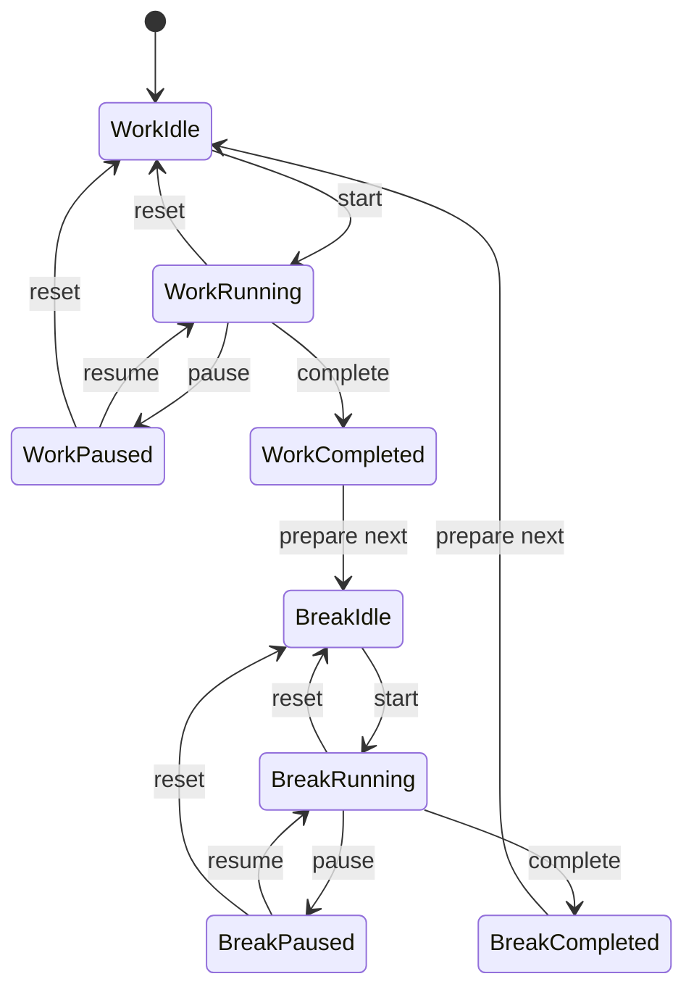

# ポモドーロタイマー Web アプリ 機能仕様

## 目的

このドキュメントは、ポモドーロタイマー Web アプリで実装する機能と、それぞれの事前条件、事後条件、不変条件を定義する。

対象機能は以下とする。

- 25 分の作業タイマー
- 5 分の休憩タイマー
- タイマーの開始
- タイマーの停止、一時停止、再開
- タイマーのリセット
- 進捗表示
- 統計機能
- ブラウザ通知
- サウンド通知
- レスポンシブ Web UI
- 設定保存

## 用語

| 用語 | 意味 |
| --- | --- |
| 作業タイマー | 25 分の集中作業セッション |
| 休憩タイマー | 5 分の休憩セッション |
| セッション | 作業または休憩の 1 回分のタイマー |
| 完了セッション | 残り時間が 0 になったセッション |
| 未完了セッション | リセットまたは切り替えにより完了しなかったセッション |
| 進捗率 | セッション全体に対して経過した割合 |

## 状態モデル

### タイマーモード

| 値 | 意味 | 初期時間 |
| --- | --- | --- |
| `work` | 作業中 | 25 分 |
| `break` | 休憩中 | 5 分 |

### タイマーステータス

| 値 | 意味 |
| --- | --- |
| `idle` | 未開始、またはリセット後 |
| `running` | タイマー進行中 |
| `paused` | 一時停止中 |
| `completed` | 完了済み |

### 状態遷移



## 共通不変条件

すべての機能は以下の不変条件を満たす。

- `mode` は `work` または `break` のいずれかである。
- `status` は `idle`、`running`、`paused`、`completed` のいずれかである。
- `durationSeconds` は 1 以上である。
- `remainingSeconds` は 0 以上である。
- `remainingSeconds` は `durationSeconds` 以下である。
- `progressPercent` は 0 以上 100 以下である。
- `running` 状態で有効なタイマー更新処理は 1 つだけである。
- `idle` 状態では `remainingSeconds` と `durationSeconds` が一致する。
- `completed` 状態では `remainingSeconds` は 0 である。
- 完了セッションは統計に 1 回だけ反映される。
- 一時停止、リセット、未完了のモード切り替えでは完了統計を増やさない。
- 通知またはサウンド再生に失敗しても、タイマー状態と統計状態は壊れない。
- UI は常に現在の状態を反映する。

## 機能 1: 作業タイマー

### 概要

25 分の作業セッションを提供する。

### 事前条件

- `mode` が `work` である。
- `durationSeconds` が `1500` である。
- `remainingSeconds` が 0 以上 1500 以下である。
- 作業タイマー開始時は `status` が `idle` または `paused` である。

### 事後条件

- 作業中の UI ラベルが表示される。
- 残り時間は `mm:ss` 形式で表示される。
- 作業タイマー完了時は `completedWorkSessions` が 1 増える。
- 作業タイマー完了時は `totalFocusSeconds` に `1500` が加算される。
- 作業タイマー完了後は休憩タイマーが次の候補になる。

### 不変条件

- 作業タイマー中の `durationSeconds` は設定変更がない限り `1500` である。
- 作業タイマーが完了するまで休憩統計は増えない。
- 作業タイマーの進捗率は作業時間に対して計算される。

## 機能 2: 休憩タイマー

### 概要

5 分の休憩セッションを提供する。

### 事前条件

- `mode` が `break` である。
- `durationSeconds` が `300` である。
- `remainingSeconds` が 0 以上 300 以下である。
- 休憩タイマー開始時は `status` が `idle` または `paused` である。

### 事後条件

- 休憩中の UI ラベルが表示される。
- 残り時間は `mm:ss` 形式で表示される。
- 休憩タイマー完了時は `completedBreakSessions` が 1 増える。
- 休憩タイマー完了時は `totalBreakSeconds` に `300` が加算される。
- 休憩タイマー完了後は作業タイマーが次の候補になる。

### 不変条件

- 休憩タイマー中の `durationSeconds` は設定変更がない限り `300` である。
- 休憩タイマーが完了するまで作業統計は増えない。
- 休憩タイマーの進捗率は休憩時間に対して計算される。

## 機能 3: タイマー開始

### 概要

現在のモードのタイマーを開始する。

### 事前条件

- `status` が `idle` または `paused` である。
- `remainingSeconds` が 1 以上である。
- `durationSeconds` が 1 以上である。
- 既存のタイマー更新処理が重複して登録されていない。
- ユーザー操作によって開始されている。

### 事後条件

- `status` が `running` になる。
- 開始基準時刻が設定される。
- 残り時間の更新が始まる。
- 進捗表示の更新が始まる。
- 開始ボタンは一時停止または停止の操作に変わる。
- リセットボタンが利用可能になる。
- ブラウザタイトルに残り時間が反映される。

### 不変条件

- 開始操作だけでは統計は増えない。
- 開始操作だけでは `mode` は変わらない。
- 開始操作だけでは `durationSeconds` は変わらない。
- `running` 状態の更新処理は常に 1 つだけである。

## 機能 4: タイマー一時停止

### 概要

進行中のタイマーを残り時間を保持したまま停止する。

### 事前条件

- `status` が `running` である。
- `remainingSeconds` が 1 以上である。
- タイマー更新処理が実行中である。

### 事後条件

- `status` が `paused` になる。
- 現在時刻までの経過時間が `remainingSeconds` に反映される。
- タイマー更新処理が停止する。
- 再開ボタンが利用可能になる。
- リセットボタンが利用可能なままになる。
- 統計は更新されない。

### 不変条件

- 一時停止中は `remainingSeconds` が自動的に減らない。
- 一時停止中は進捗率が自動的に変化しない。
- 一時停止では完了通知は送信されない。
- 一時停止では完了統計は増えない。

## 機能 5: タイマー再開

### 概要

一時停止中のタイマーを再開する。

### 事前条件

- `status` が `paused` である。
- `remainingSeconds` が 1 以上である。
- タイマー更新処理が実行されていない。

### 事後条件

- `status` が `running` になる。
- 再開基準時刻が設定される。
- 残り時間の更新が再開される。
- 進捗表示の更新が再開される。
- UI は一時停止可能な表示になる。

### 不変条件

- 再開操作だけでは統計は増えない。
- 再開操作だけでは `mode` は変わらない。
- 再開後も残り時間は一時停止時点から継続する。

## 機能 6: タイマーリセット

### 概要

現在のタイマーを初期状態に戻す。

### 事前条件

- `status` が `running`、`paused`、`completed` のいずれかである、または `remainingSeconds` が `durationSeconds` 未満である。
- 現在の `mode` に対応する `durationSeconds` が設定されている。

### 事後条件

- `status` が `idle` になる。
- `remainingSeconds` が `durationSeconds` と一致する。
- 開始基準時刻、一時停止時刻、完了時刻がクリアされる。
- タイマー更新処理が停止する。
- 進捗表示が 0% に戻る。
- ブラウザタイトルが初期表示に戻る。
- 統計は更新されない。

### 不変条件

- リセットでは `mode` は変わらない。
- リセットでは完了統計は増えない。
- リセット後の `remainingSeconds` は `durationSeconds` と一致する。

## 機能 7: タイマー完了

### 概要

残り時間が 0 になったセッションを完了扱いにする。

### 事前条件

- `status` が `running` である。
- `remainingSeconds` が 0 以下として計算されている。
- 対象セッションがまだ完了処理済みではない。
- `mode` が `work` または `break` である。

### 事後条件

- `status` が `completed` になる。
- `remainingSeconds` が 0 になる。
- 完了時刻が設定される。
- タイマー更新処理が停止する。
- 進捗表示が 100% になる。
- 現在モードに対応する統計が更新される。
- ブラウザ通知が試行される。
- サウンド通知が試行される。
- 次のモードが準備される。

### 不変条件

- 完了処理は 1 セッションにつき 1 回だけ実行される。
- 完了後の `remainingSeconds` は 0 のままである。
- 完了後に同じセッションを再度開始しない。
- 通知失敗は統計更新を取り消さない。

## 機能 8: モード切り替え

### 概要

作業タイマーと休憩タイマーを切り替える。

### 事前条件

- 自動切り替えの場合、現在の `status` が `completed` である。
- 手動切り替えの場合、現在の `status` が `idle` または `completed` である。
- `running` 中の手動切り替えは許可しない。
- `paused` 中の手動切り替えは、確認後にリセット相当として扱う。

### 事後条件

- `mode` が `work` から `break`、または `break` から `work` に変わる。
- `durationSeconds` が新しいモードの初期時間になる。
- `remainingSeconds` が `durationSeconds` と一致する。
- `status` が `idle` になる。
- 進捗表示が 0% に戻る。
- UI ラベルが新しいモードを示す。

### 不変条件

- モード切り替えだけでは統計は増えない。
- `running` 中に `mode` は変わらない。
- 切り替え後は新しいモードの時間設定だけが使われる。

## 機能 9: 進捗表示

### 概要

現在のセッションの進捗を円形ゲージまたはバーで表示する。

### 事前条件

- `durationSeconds` が 1 以上である。
- `remainingSeconds` が 0 以上 `durationSeconds` 以下である。
- UI 上に進捗表示要素が存在する。

### 事後条件

- 進捗率が現在の残り時間に基づいて表示される。
- `idle` 状態では 0% が表示される。
- `running` 状態では時間経過に応じて進捗が増える。
- `paused` 状態では一時停止時点の進捗が保持される。
- `completed` 状態では 100% が表示される。

### 不変条件

- 進捗率は保存値ではなく `durationSeconds` と `remainingSeconds` から計算する。
- 進捗率は 0% 未満にならない。
- 進捗率は 100% を超えない。
- 表示上の進捗と残り時間は同じ状態から導出される。

## 機能 10: 統計表示

### 概要

完了した作業セッション数、集中時間、休憩回数などを表示する。

### 事前条件

- 統計状態が初期化されている。
- 保存済み統計がある場合は `localStorage` から復元されている。
- 統計値は 0 以上の数値である。

### 事後条件

- 今日の完了数が表示される。
- 今日の集中時間が表示される。
- 累計完了数が必要に応じて表示される。
- 作業セッション完了時に作業統計が更新される。
- 休憩セッション完了時に休憩統計が更新される。
- 更新後の統計が `localStorage` に保存される。

### 不変条件

- 統計値は負の値にならない。
- 完了していないセッションは統計に含めない。
- 同じ完了セッションを二重に加算しない。
- 表示値と保存値は同じ統計状態から導出される。

## 機能 11: ブラウザ通知

### 概要

タイマー完了時にブラウザ通知を表示する。

### 事前条件

- `Notification` API がブラウザで利用可能である。
- 通知権限が `granted` である。
- 通知権限が `default` の場合は、ユーザー操作をきっかけに許可を要求できる。
- タイマー完了イベントが発生している。

### 事後条件

- 権限が許可されている場合、完了通知が表示される。
- 権限が拒否されている場合、画面内表示にフォールバックする。
- 通知できない場合もタイマー完了状態は維持される。
- 通知できない場合も統計更新は維持される。

### 不変条件

- 通知権限要求はユーザー操作なしに実行しない。
- 通知失敗でアプリ全体を停止しない。
- 通知失敗で統計を巻き戻さない。
- 完了していないセッションでは完了通知を送らない。

## 機能 12: サウンド通知

### 概要

タイマー完了時に音で知らせる。

### 事前条件

- サウンド通知が有効である。
- ブラウザが音声再生を許可している。
- 音声ファイルまたは Web Audio API が利用可能である。
- タイマー完了イベントが発生している。

### 事後条件

- 完了音が再生される。
- 再生に失敗した場合もタイマー完了状態は維持される。
- 再生に失敗した場合も統計更新は維持される。

### 不変条件

- サウンド通知が無効の場合は音を再生しない。
- 完了していないセッションでは完了音を再生しない。
- 音声再生失敗でアプリ全体を停止しない。

## 機能 13: レスポンシブ Web UI

### 概要

デスクトップとモバイルの両方で利用しやすい画面を提供する。

### 事前条件

- HTML にビューポート設定がある。
- UI 要素が固定幅だけに依存していない。
- 操作ボタンはタッチ操作できるサイズである。

### 事後条件

- デスクトップでは UI モックに近い中央カード表示になる。
- モバイルでは画面幅に収まり、横スクロールが発生しない。
- タイマー表示、ボタン、統計パネルが重ならない。
- 文字がボタンやカードからはみ出さない。
- タッチ操作しやすい余白が確保される。

### 不変条件

- 主要操作はどの画面幅でも表示される。
- タイマー残り時間は常に最も目立つ要素である。
- 操作ボタンは状態に応じて一貫した意味を持つ。
- UI 状態とタイマー状態は常に一致する。

## 機能 14: 設定保存

### 概要

ユーザー設定と統計をブラウザに保存する。

### 事前条件

- `localStorage` が利用可能である。
- 保存対象の値が JSON としてシリアライズ可能である。
- 保存対象の値が型と範囲の検証を通過している。

### 事後条件

- 設定変更後に `localStorage` へ保存される。
- ページ再読み込み後に保存済み設定が復元される。
- 保存済み値が不正な場合は既定値にフォールバックする。
- 統計更新後に最新値が保存される。

### 不変条件

- 不正な保存値でアプリを起動不能にしない。
- 保存失敗時も現在のメモリ上の状態で操作を継続する。
- 保存値はアプリ内状態の派生元として一貫した形式を保つ。

## 機能 15: 画面タイトル更新

### 概要

ブラウザのタブタイトルに現在のタイマー状態を反映する。

### 事前条件

- タイマー状態が初期化されている。
- `document.title` を更新できる。

### 事後条件

- `running` 中は残り時間とモードがタイトルに表示される。
- `paused` 中は一時停止中であることがタイトルに表示される。
- `idle` または `completed` ではアプリ名が分かるタイトルに戻る。

### 不変条件

- タイトル表示はタイマー状態から導出される。
- タイトル更新失敗でタイマー状態は変わらない。

## 主要イベント別の条件一覧

| イベント | 遷移 | 事前条件 | 事後条件 | 不変条件 |
| --- | --- | --- | --- | --- |
| `START` | `idle -> running` または `paused -> running` | 残り時間が 1 秒以上、更新処理が重複していない | 状態が進行中になり更新開始 | 統計は増えない |
| `PAUSE` | `running -> paused` | 進行中で残り時間がある | 残り時間を保持して更新停止 | 完了通知は送らない |
| `RESUME` | `paused -> running` | 一時停止中で残り時間がある | 更新処理が再開 | モードは変わらない |
| `RESET` | `running/paused/completed -> idle` | 初期化可能な状態である | 残り時間が初期値に戻る | 統計は増えない |
| `TICK` | `running -> running` | 進行中である | 残り時間と進捗を再計算 | 残り時間は 0 未満にしない |
| `COMPLETE` | `running -> completed` | 残り時間が 0 以下、未完了処理 | 統計更新、通知試行、次モード準備 | 完了処理は 1 回だけ |
| `SWITCH_MODE` | `completed/idle -> idle` | 進行中ではない | モードと初期時間を切り替える | 切り替えだけでは統計は増えない |
| `SAVE_SETTINGS` | 状態維持 | 値が妥当である | 保存値が更新される | 不正値は保存しない |
| `REQUEST_NOTIFICATION` | 状態維持 | API 利用可能、ユーザー操作中 | 権限状態が更新される | 拒否されてもタイマーは継続 |

## 初期状態

アプリ起動直後の初期状態は以下とする。

```js
const initialState = {
  timer: {
    mode: "work",
    status: "idle",
    durationSeconds: 1500,
    remainingSeconds: 1500,
    startedAt: null,
    pausedAt: null,
    completedAt: null,
  },
  stats: {
    completedWorkSessions: 0,
    completedBreakSessions: 0,
    totalFocusSeconds: 0,
    totalBreakSeconds: 0,
    todayCompletedWorkSessions: 0,
    todayFocusSeconds: 0,
    lastCompletedAt: null,
  },
  notifications: {
    browserPermission: "default",
    soundEnabled: true,
  },
};
```

## 完了判定の注意点

ブラウザでは `setInterval` が正確に 1 秒ごとに実行されるとは限らない。そのため、残り時間は interval の回数ではなく現在時刻との差分で計算する。

```text
remainingSeconds = max(0, durationSeconds - elapsedSeconds)
```

`remainingSeconds` が 0 になったら `COMPLETE` イベントを発行する。ただし、同一セッションで `COMPLETE` が複数回処理されないように、`status` または `completedAt` を使って完了済みかどうかを判定する。
